# Reporte de práctica

1. [Estructura del proyecto](#Estructura-del-proyecto)
2. [Pruebas unitarias](#Pruebas-unitarias)
3. [Sección 1: Búsqueda a ciegas](#Sección-1-Búsqueda-a-ciegas)
   1. [s1.py](#s1py)
   2. [Pruebas con grafos con `osmnx`](#Pruebas-con-grafos-con-osmnx)
   3. [Hardware y software](#Hardware-y-software-S1)
   4. [Ejecución de BFS](#Ejecución-de-BFS)
   5. [Ejecución de DFS](#Ejecución-de-DFS)
   6. [Ejecución de UCS](#Ejecución-de-UCS)
   7. [Ejecución de fallida de BFS](#Ejecución-de-fallida-de-BFS)
   8. [Ejecución de fallida de DFS](#Ejecución-de-fallida-de-DFS)
   9. [Ejecución de fallida de UCS](#Ejecución-de-fallida-de-UCS)
   10. [Preguntas de análisis](#Preguntas-de-análisis-S1)
   11. [Conclusiones](#Conclusiones-s1)
4. [Sección 2: Algoritmos de Búsqueda Informada (A* y Greedy Best-First)](#Sección-2-algoritmos-de-búsqueda-informada-a-y-greedy-best-first)
   1. [Objetivos](#Objetivos)
   2. [Tareas requeridas](#Tareas-requeridas)
   3. [Marco Teórico y Justificación de Heurísticas](#Marco-Teórico-y-Justificación-de-Heurísticas)
   4. [Demostración de Admisibilidad y Consistencia](#Demostración-de-Admisibilidad-y-Consistencia)
   5. [Pruebas Experimentales y Resultados](#Pruebas-Experimentales-y-Resultados)
   6. [Hardware y software](#Hardware-y-software-S2)
   7. [Cuestionario y Análisis de Resultados](#Cuestionario-y-Análisis-de-Resultados)
   8. [Conclusiones](#Conclusiones)
5. [Sección 3: Búsqueda local](#Sección-3-Búsqueda-local)
   1. [s3.py](#s3py)
   2. [Hardware y software](#Hardware-y-software-S3)
   3. [Ejecución de los algoritmos con valores por defecto](#Ejecución-de-los-algoritmos-con-valores-por-defecto)
   4. [Ejecución de los algoritmos con modificaciones](#Ejecución-de-los-algoritmos-con-modificaciones)
   5. [Preguntas de análisis y conclusiones](#Preguntas-de-análisis-y-conclusiones)
6. [Referencias](#Referencias)


## Estructura del proyecto

El proyecto tiene diferentes directorios y archivos,
- `src`: Contiene los archivos de las diferentes secciones
- `src/tests`: Contiene tests escritos con `pytest` para cada 
  sección, estos contrastas los resultados de los ejemplos vistos 
  en clase con los arrojados por el algoritmo implementado 
- `main.py`: Punto de entrada, más información en [README.md](README.md)

## Pruebas unitarias

Las pruebas unitarias prueban la funcionalidad del método 
`perform_search` contrastando los resultados del programa en 
`busqueda_no_informada.html`.

Los resultados de DFS y BFS discrepan entre el algoritmo 
implementado y el programa de `busqueda_no_informada.html`, 
esto se debe al cómo funcionan los diccionarios de datos en 
Python. En `s1_test` los datos del grafo están descritos en un
diccionario de datos, estructura que automáticamente ordena las
llaves, esto tiene como consecuencia que los nodos se insertan 
de forma ordenada, por lo que al momento de ejecutar el algoritmo
los nodos adyacentes se exploran de esta forma, esto no 
necesariamente sucede en el programa de `busqueda_no_informada.html`.


## Sección 1: Búsqueda a ciegas

En esta sección se implementó un algoritmo "genérico" que 
simplemente cambia la estructura de datos en función del 
algoritmo que se quiere ejecutar.

### s1.py

Archivo principal de la sección 1. En esta sección se encuentran 
diferentes clases y funciones,

- `Algorithm(Enum)`: enum que tiene un listado de los algoritmos 
  que se pueden utilizar con la clase `UFSA`
- `UFSA(Metrics)`: "Uninformed Search Algorithms" es la clase que
  implementa un único algoritmo de búsqueda no informada que cambia
  la estructura de datos con base en el algoritmo seleccionado.
- `plot_graph(...)`: función que gráfica el grafo, utiliza diferentes 
  colores para distinguir entre el nodo inicial (verde), 
  nodo final (azul) y los nodos de frontera (naranja).
- La función `plot_snapshots(ufsa: UFSA)`, utiliza 
  `multiprocessing` para mostrar los tres momentos de la frontera 
  al mismo tiempo en diferentes ventanas, `matplotlib` no
  es _thread-safe_, por lo que `threading` no es compatible.
- `run(**kwargs)`: punto de entrada que orquesta la ejecución de los
  algoritmos.

### Pruebas con grafos con `osmnx`

Las pruebas se ejecutaron con la Escuela Superior de Cómputo como
epicentro, y con todos los nodos a una distancia de 2 km, utilizando
el siguiente comando,

```shell
python3 main.py s1 --distance 2000 --graph
```

### Hardware y software S1

| Nombre  | Valor                  |
|---------|------------------------|
| CPU     | Apple M4 de 10 núcleos |
| Memoria | 16 GB LPDDR5           |
| OS      | macOS 15.7.4           |
| Python  | v3.14.6:c63aec69bd5    |


### Ejecución de BFS

<pre>
Reporte de BFS
  Nodo inicial:     94144498
  Nodo final:       1588601898
  Nodos totales:    476
  Ruta:             94144498 → 17809170 → 94143538 → 9300602214 → 17809166 → 5749702260 → 151354808 → 152737653 → 152737652 → 2175327576 → 1588595442 → 1588595435 → 1588601898
  Nodos expandidos: 1470
  Distancia total:  1606.1046201895174
  Total de arcos:   12
    Tamaño de
  frontera máximo:  848
    Tiempo de
    ejecución:      4.3967 ms 
</pre>

| Frontera 1            | Frontera 2            | Frontera 3            |
|-----------------------|-----------------------|-----------------------|
| 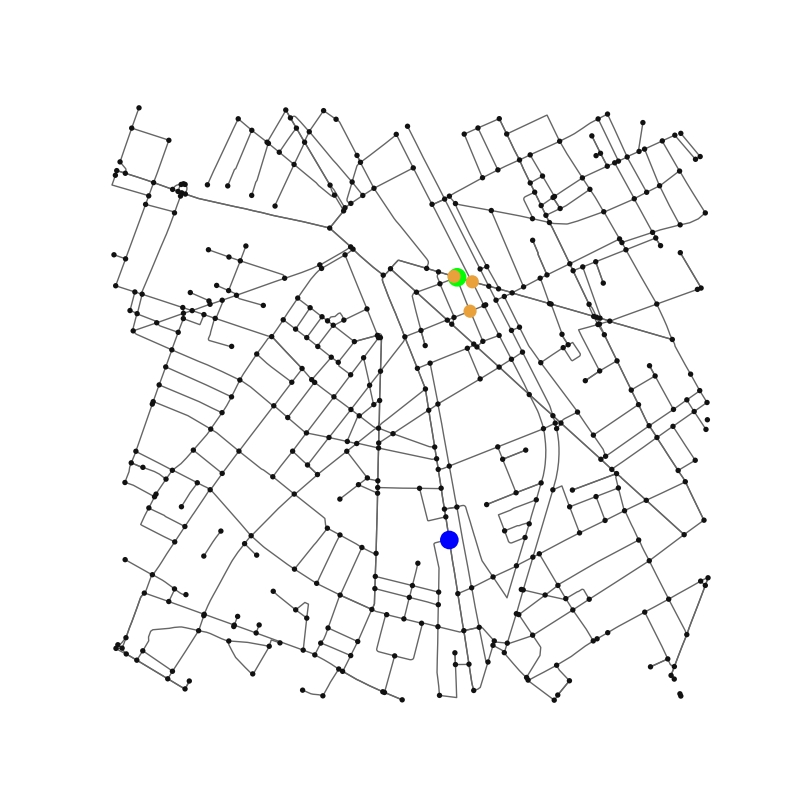 |  | 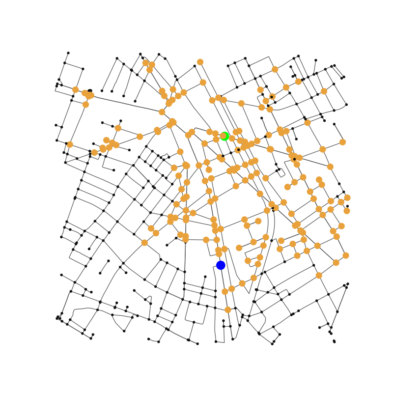 |


### Ejecución de DFS

<pre>
Reporte de DFS
  Nodo inicial:     94144498
  Nodo final:       1588601898
  Nodos totales:    476
  Ruta:             94144498 → 17809163 → 367967 → 151357427 → 151357502 → 25034664 → 5116936565 → 704766 → 151358603 → 13336347838 → 151360584 → 256409832 → 256409987 → 256409741 → 1761555130 → 34674622 → 34674624 → 34151805 → 430788 → 5773573552 → 151361754 → 151361175 → 256413458 → 5749702259 → 5749702260 → 151354808 → 152738277 → 152737902 → 406653331 → 152737653 → 152737652 → 152737125 → 94141096 → 152739331 → 2175327576 → 1588595442 → 1588595435 → 697813609 → 573458028 → 573458029 → 26401805 → 26666918 → 218155202 → 26666919 → 1588601898
  Nodos expandidos: 12994
  Distancia total:  4263.216671449974
  Total de arcos:   44
    Tamaño de
  frontera máximo:  31
    Tiempo de
    ejecución:      58.2731 ms 
</pre>

| Frontera 1            | Frontera 2            | Frontera 3            |
|-----------------------|-----------------------|-----------------------|
| 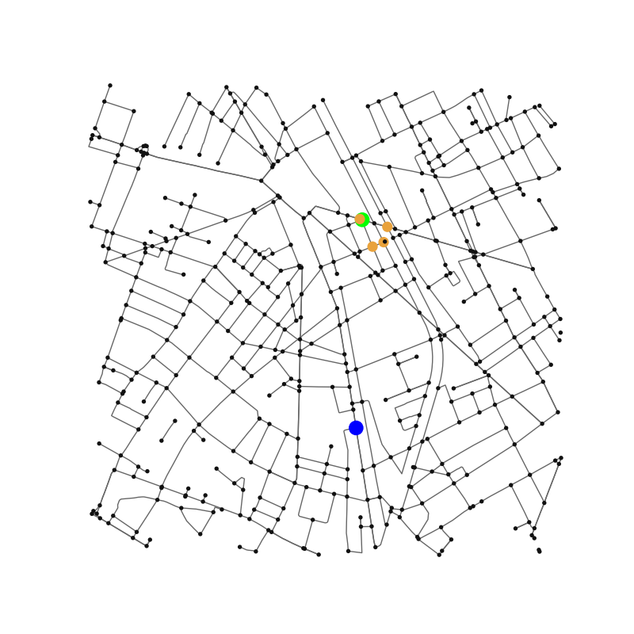 | 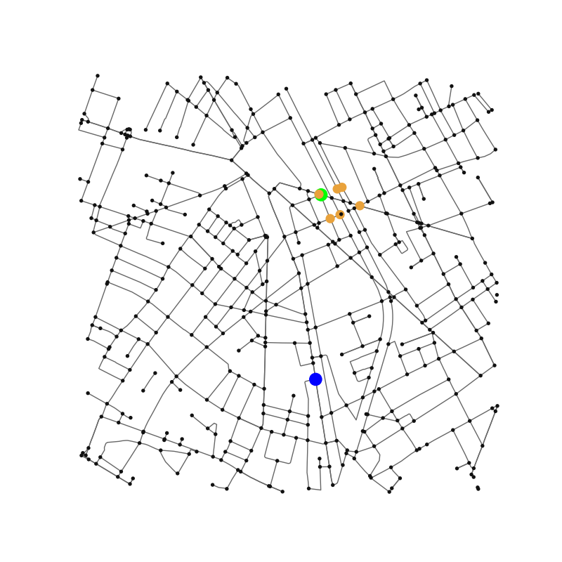 | 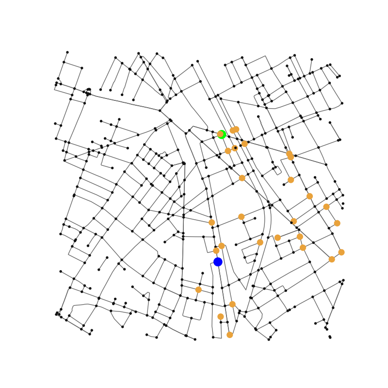 |


### Ejecución de UCS

<pre>
Reporte de UCS
  Nodo inicial:     94144498
  Nodo final:       1588601898
  Nodos totales:    476
  Ruta:             94144498 → 17809170 → 94144708 → 94143743 → 94145388 → 94140737 → 94143863 → 94139827 → 94139897 → 94139728 → 178889521 → 152737125 → 94141096 → 152739331 → 227073732 → 1588601898
  Nodos expandidos: 2228
  Distancia total:  1056.1395886679431
  Total de arcos:   15
    Tamaño de
  frontera máximo:  1202
    Tiempo de
    ejecución:      13.0460 ms 
</pre>

| Frontera 1            | Frontera 2            | Frontera 3            |
|-----------------------|-----------------------|-----------------------|
| 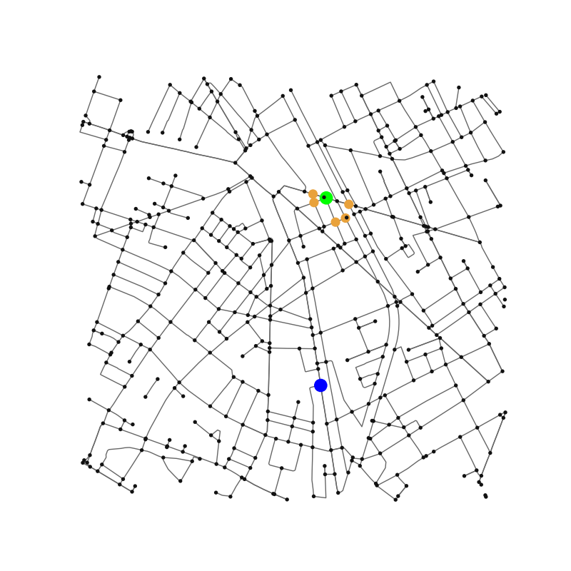 |  | 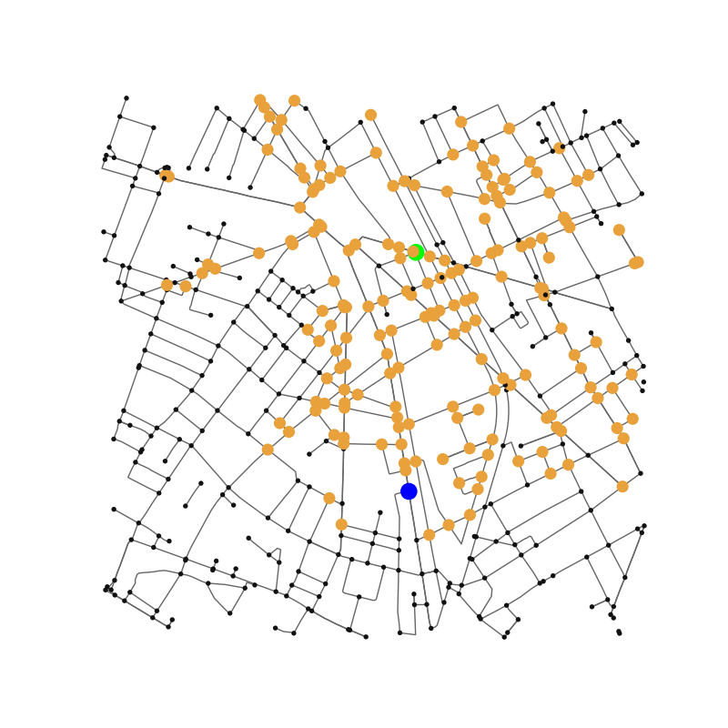 |


### Ejecución de fallida de BFS

Las siguientes pruebas fallaron porque el algoritmo no fue capaz
de encontrar una ruta entre los nodos de inicio y fin, incluso si
el timeout se cambia a 10 s, esto debido a la desconexión entre 
nodos.

<pre>
Reporte de BFS
  Nodo inicial:     35514154
  Nodo final:       431394905
  Nodos totales:    476
  Ruta:             
  Nodos expandidos: 816200
  Distancia total:  No termino,
  Total de arcos:   timeout de 3s
    Tamaño de
  frontera máximo:  402219
    Tiempo de
    ejecución:      3.0059 s 
</pre>

| Frontera 1              | Frontera 2              | Frontera 3              |
|-------------------------|-------------------------|-------------------------|
|  |  | 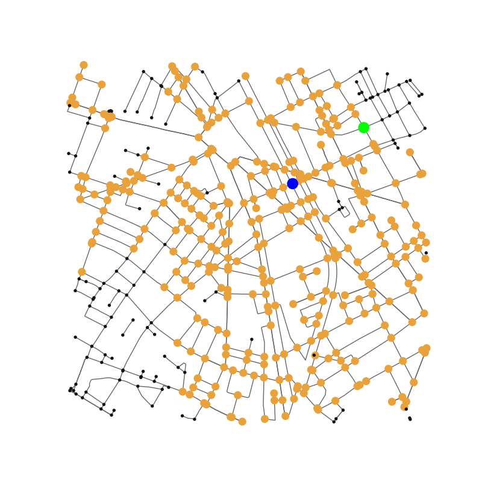 |


### Ejecución de fallida de DFS

<pre>
Reporte de DFS
  Nodo inicial:     35514154
  Nodo final:       431394905
  Nodos totales:    476
  Ruta:             
  Nodos expandidos: 825132
  Distancia total:  No termino,
  Total de arcos:   timeout de 3s
    Tamaño de
  frontera máximo:  85
    Tiempo de
    ejecución:      3.0000 s 
</pre>

| Frontera 1              | Frontera 2              | Frontera 3              |
|-------------------------|-------------------------|-------------------------|
| 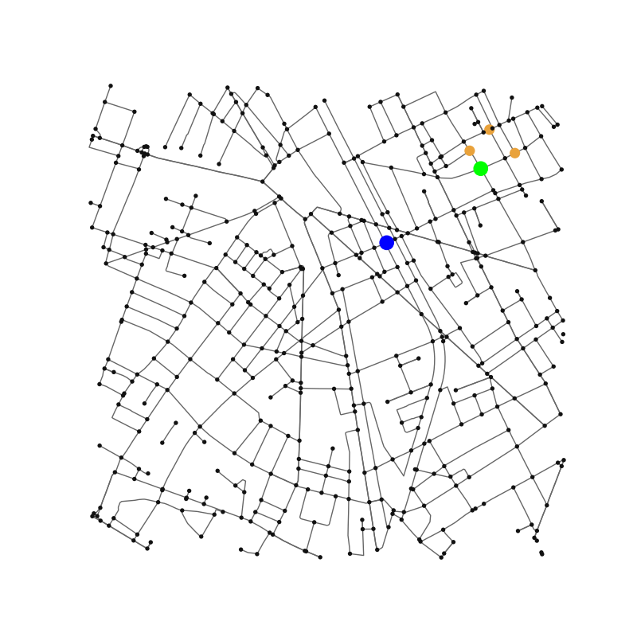 | 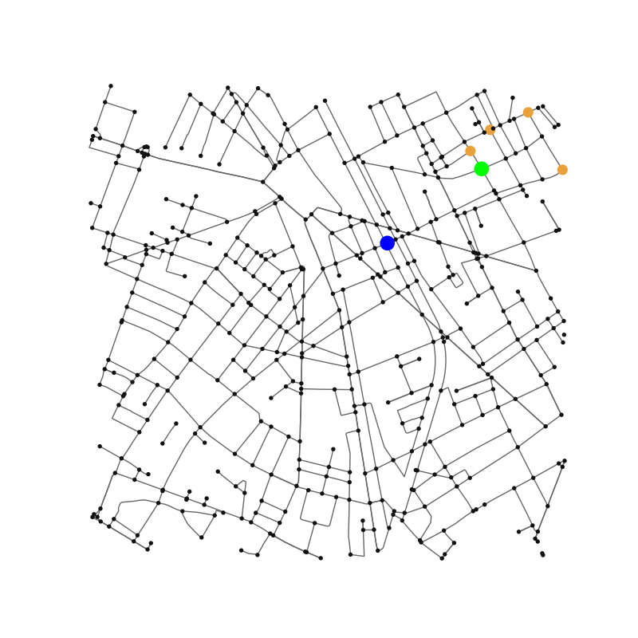 | 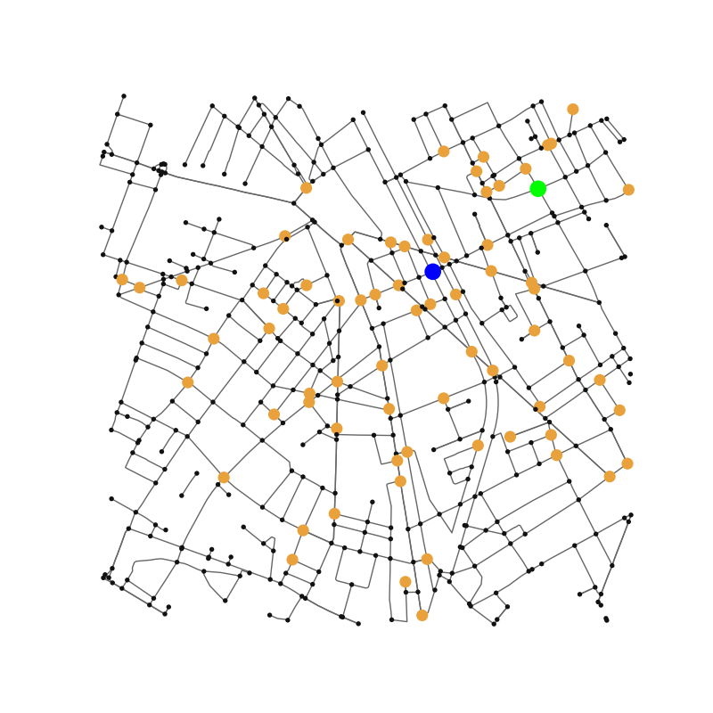 |


### Ejecución de fallida de UCS

<pre>
Reporte de UCS
  Nodo inicial:     35514154
  Nodo final:       431394905
  Nodos totales:    476
  Ruta:             
  Nodos expandidos: 648370
  Distancia total:  No termino,
  Total de arcos:   timeout de 3s
    Tamaño de
  frontera máximo:  310714
    Tiempo de
    ejecución:      3.0694 s 
</pre>

| Frontera 1              | Frontera 2              | Frontera 3              |
|-------------------------|-------------------------|-------------------------|
| 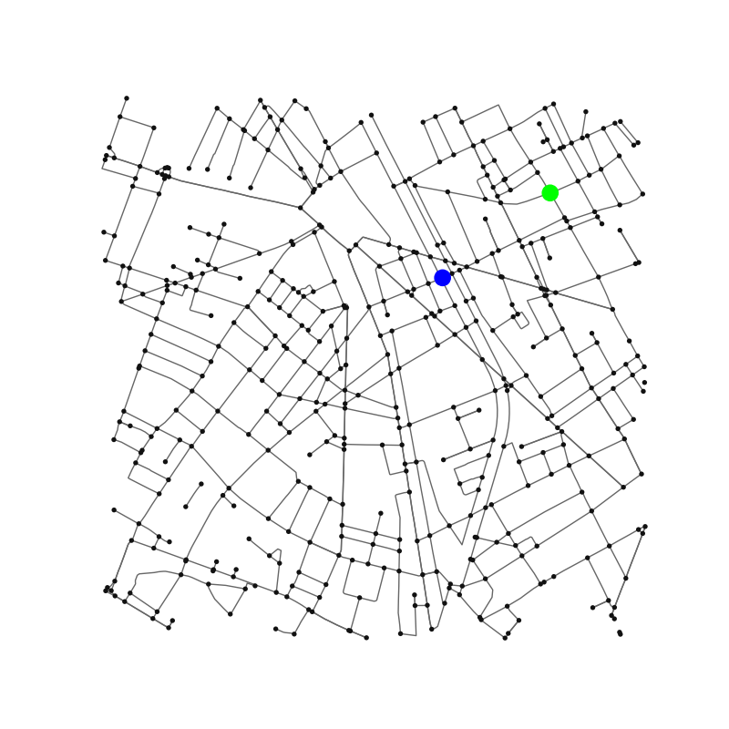 | 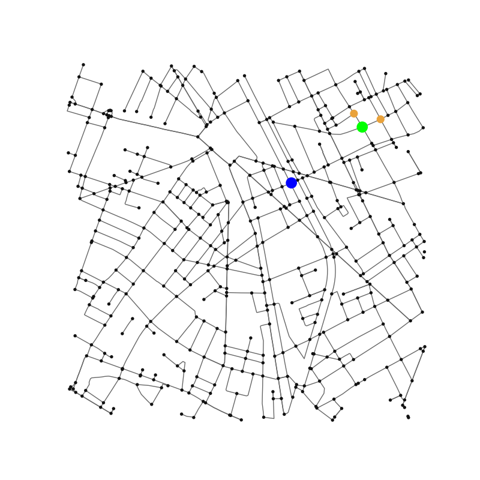 | 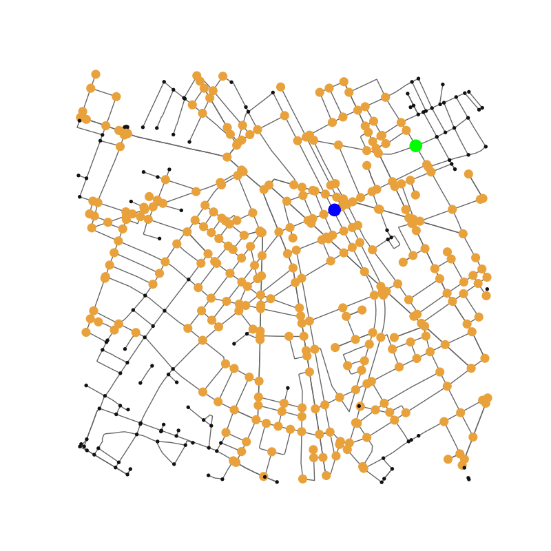 |


### Preguntas de análisis S1

- **¿Por qué BFS garantiza el camino con menos saltos pero no el de menor distancia?**

Esto es porque en algunos grafos existen diferentes rutas de un 
nodo de inicio a uno final, pero no todas tienen el mismo costo 
acumulado, por lo que aunque se BFS da el camino con menos saltos, 
no toma en cuenta el peso para decidir por un camino u otro.

- **¿En qué estructuras de grafo DFS es preferible? ¿Aplica en este caso urbano?**

Las estructuras deben ser grafos completos, ya que si existen 
conjuntos de nodos no conectados y el nodo de inicio o final 
están en estos subconjuntos, el algoritmo no podrá encontrar 
el otro nodo. Los grafos urbanos no siempre cumplen la condición 
de ser completos.

Si lo que se quiere saber es si se puede llegar de un lugar 'A' a 
un lugar 'B' de forma "rápida", DFS funciona bien, pero no funciona
si se requiere saber cuál es el camino con menos salto o menos
distancia.

- **¿Cuándo UCS y BFS producen exactamente el mismo resultado?**

Producen el mismo resultado cuando el camino de menos arcos (BFS)
es el mismo que el de menor costo (UCS).


### Conclusiones S1

En entornos urbanos, el algoritmo UCS es el mejor para encontrar 
la ruta óptima, como se ve en las pruebas, en comparación con BFS
y DFS.

Existe una relación entre la selección de una mejor ruta y el 
tamaño de frontera, DFS tuvo la frontera más pequeña, pero a costa
de una calidad baja, BFS fue el más rápido y UCS fue el que más
nodos en frontera tuvo.


## Sección 2: Algoritmos de Búsqueda Informada (A* y Greedy Best-First)

La siguiente sección documenta la implementación, evaluación y análisis empírico del algoritmo de búsqueda A* utilizando diferentes funciones heurísticas del tipo A*, en comparación con Greedy Best-First Search (GBFS). Se evalúa el desempeño de las heurísticas en términos de nodos expandidos, costo del camino y tiempo de ejecución; además el Factor de ramificación efectiva b* en los resultados nos muestra la eficiencia que tiene cada algoritmo en el control de espacio de búsqueda. Cada uno de los datos anteriores se calcula sobre un grafo urbano extraído de OpenStreetMap. Los resultados demuestran que el uso de una heurística admisible y consistente reduce el espacio de búsqueda explorado manteniendo la optimalidad del costo del camino.

### Objetivos

#### Objetivo General

Implementar A* con múltiples heurísticas geográficas y demostrar empíricamente que una heurística
admisible reduce los nodos expandidos respecto a UCS sin comprometer la optimalidad del camino.

### Tareas requeridas

- Implementar A* apoyado en una cola de prioridad que ordene por $f(n) = g(n) + h(n)$.
- Definir e implementar tres heurísticas geográficas: Distancia Euclidiana ($h_1$), Distancia de Haversine ($h_2$) y una heurística personalizada ($h_3$).
- Verificar la admisibilidad de cada heurística de forma experimental o teórica que $h(n) <= costo real minimo$.
- Implementar el algoritmo Greedy Best-First Search y comparar contra A* para ilustrar no-optimalidad.
- Medir la calidad informativa de las heurísticas mediante el factor de ramificación efectiva ($b^*$).
- Visualizar interactivamente las rutas generadas sobre el mapa urbano utilizando la librería `folium`.
- Construir tablas comparativas.

### Marco Teórico y Justificación de Heurísticas

#### Algoritmos de Búsqueda

**A\* Search:** Algoritmo de búsqueda informada que selecciona el siguiente nodo a expandir según la función de evaluación $f(n) = g(n) + h(n)$, donde $g(n)$ es el costo acumulado que suma cada nodo que se explora(puede ser parte de la solución final o no) desde el origen hasta el nodo $n$, y $h(n)$ es la estimación del costo restante hasta el destino(costo calculado en línea recta desde el nodo actual hasta el nodo objetivo).

**Greedy Best-First Search (GBFS):** Búsqueda informada que evalúa nodos únicamente por $f(n) = h(n)$. Prioriza la cercanía aparente a la meta sin considerar el costo acumulado $g(n)$, lo que puede provocar una solución que no es la más óptima a cambio de velocidad.

#### Definición de Heurísticas Implementadas

**$h_1$ — Distancia Euclidiana (Proyectada)**

Calcula la línea recta cartesiana considerando las coordenadas proyectadas $(x_n, y_n)$ y $(x_d, y_d)$, lo que provoca una distancia teórica ideal(no se toma en cuenta la curvatura de la tierra):

$$h_1(n) = \sqrt{(x_d - x_n)^2 + (y_d - y_n)^2}$$

**$h_2$ — Distancia de Haversine**

Calcula el camino más corto a lo largo de la superficie de una esfera (distancia ortodrómica) a partir de las coordenadas en latitud y longitud $(\phi, \lambda)$ expresadas en radianes:

$$h_2(n) = 2R \cdot \arcsin\left( \sqrt{\sin^2\left(\frac{\Delta \phi}{2}\right) + \cos(\phi_n)\cos(\phi_d)\sin^2\left(\frac{\Delta \lambda}{2}\right)} \right)$$

Donde $R \approx 6{,}371{,}000\ \text{m}$ es el radio medio terrestre.

**$h_3$ — Heurística Personalizada (Distancia + Estimación de Giros)**

Diseñada para modelar el costo en redes viales combinando la distancia de Haversine con una penalización estimada por cambios de dirección hacia el nodo destino:

$$h_3(n) = h_2(n) + \alpha \cdot \theta(n)$$

Donde $\theta(n)$ estima la desviación angular respecto al vector hacia la meta y $\alpha$ es un parámetro de ponderación ajustable.

### Demostración de Admisibilidad y Consistencia

Para garantizar la optimalidad de A* en grafos de estado, la heurística $h(n)$ debe ser **admisible**: nunca debe sobreestimar el costo real para alcanzar la meta desde ningún nodo $n$, en la exploración de nodos cuando esto sucede ese nodo se excluye de la solución y el algoritmo continúa explorando otros nodos para encontrar la solución más óptima.

$$h(n) \le h^*(n) \quad \forall n$$

#### Análisis de Admisibilidad de $h_1$ y $h_2$

- **$h_2$ (Haversine):** Representa la distancia geodésica mínima en línea recta sobre la esfera terrestre entre el nodo $n$ y el destino. Como ningún camino físico por calles terrestres puede ser más corto que la línea recta geográfica que une ambos puntos, se cumple estrictamente $h_2(n) \le h^*(n)$. Por lo tanto, $h_2$ es admisible y consistente.

- **$h_1$ (Euclidiana):** En la impresión de la solución en el grafo dado esta se muestra igual a haversine, y a la solución ponderada, sin embargo, tenemos un porcentaje de error en las distancias que se comprueba por nuestra distancia calculada entre nuestros nodos empresa y destinos conectados con líneas rectas, dado que los costos de cada arista nos los da por defecto openstreetmap con valores reales(curvatura terrestre) la solución se nos da con ese costo total. Sin embargo, es calculable por el porcentaje de diferencia dado el valor real de la solución de manera euclidiana.

#### Análisis de $h_3$ (Heurística Ponderada)

Si $\alpha > 0$, la adición de la estimación de giros puede ocasionar que en algunos casos $h_3(n) > h^*(n)$ (por ejemplo, si el camino real requiere giros que acortan el tiempo o si sobreestima el costo de maniobra). Si $h_3(n)$ sobreestima el costo real, deja de ser admisible y A* pierde la garantía teórica de encontrar el camino estrictamente óptimo.

### Pruebas Experimentales y Resultados

Las pruebas se ejecutaron sobre un sub grafo urbano extraído mediante OSMnx, las zonas que comprenden el grafo(Cuauhtémoc, Gustavo A. Madero, Venustiano Carranza y Azcapotzalco) fueron delimitadas a un espacio de pruebas elegido de manera random con los siguientes valores(500 y 1500 nodos con 1 empresa y 20 destinos, 500 nodos con 1 empresa y 99 destinos y 1500 con 1 empresa y 299 destinos).

#### Tabla Comparativa de Desempeño

### Hardware y software S2

| Nombre  | Valor               |
|---------|---------------------|
| CPU     | Intel core i5 7300U |
| Memoria | 8 GB LPDDR3-SDRAM   |
| OS      | Windows 10 pro 22H2 |
| Python  | 3.14.7              |

#### Pruebas

*1er ejecución* python main.py s2 --test test-only

Prueba 500 nodos, 1 empresa, 19 destinos.

Distancia euclidiana(directa) total = 14254.40m

Distancia Haversine(directa) total = 14279.45m

| Algoritmo / Heurística   | Distancia en metros | Nodos expandidos | Tiempo de Ejecución (ms) | Factor $b^*$ | Cantidad de nodos de la solución |
|--------------------------|---------------------|------------------|--------------------------|--------------|----------------------------------|
| A* $h_1$ (Euclidiana)    | 16967.05            | 745              | 14.03                    | 1.013        | 179                              |
| A* $h_2$ (Haversine)     | 16967.05            | 745              | 19.37                    | 1.013        | 179                              |
| A* $h_3$ (Personalizada) | 16967.05            | 896              | 17.69                    | 1.015        | 179                              |
| Greedy Best-First        | 17222.35            | 310              | 3.10                     | 1.005        | 183                              |

Prueba 1500 nodos, 1 empresa, 19 destinos.

Distancia euclidiana(directa) total = 15195.42m

Distancia Haversine(directa) total = 15222.12m

| Algoritmo / Heurística   | Distancia en metros | Nodos expandidos | Tiempo de Ejecución (ms) | Factor $b^*$ | Cantidad de nodos de la solución |
|--------------------------|---------------------|------------------|--------------------------|--------------|----------------------------------|
| A* $h_1$ (Euclidiana)    | 25615.97            | 1007             | 16.93                    | 1.009        | 251                              |
| A* $h_2$ (Haversine)     | 25615.97            | 1004             | 27.20                    | 1.009        | 251                              |
| A* $h_3$ (Personalizada) | 25615.97            | 1468             | 23.23                    | 1.012        | 251                              |
| Greedy Best-First        | 25615.97            | 567              | 5.00                     | 1.004        | 286                              |

Prueba 500 nodos, 1 empresa, 99 destinos.

Distancia euclidiana(directa) total = 21669.60m

Distancia Haversine(directa) total = 21707.68m

| Algoritmo / Heurística   | Distancia en metros | Nodos expandidos | Tiempo de Ejecución (ms) | Factor $b^*$ | Cantidad de nodos de la solución |
|--------------------------|---------------------|------------------|--------------------------|--------------|----------------------------------|
| A* $h_1$ (Euclidiana)    | 39834.01            | 1857             | 69.12                    | 1.003        | 590                              |
| A* $h_2$ (Haversine)     | 39834.01            | 1847             | 120.78                   | 1.003        | 590                              |
| A* $h_3$ (Personalizada) | 39772.99            | 2448             | 89.86                    | 1.004        | 599                              |
| Greedy Best-First        | 41404.32            | 1043             | 21.63                    | 1.002        | 594                              |

Prueba 1500 nodos, 1 empresa, 299 destinos.

Distancia euclidiana(directa) total = 42428.53m

Distancia Haversine(directa) total = 42503.10m

| Algoritmo / Heurística   | Distancia en metros | Nodos expandidos | Tiempo de Ejecución (ms) | Factor $b^*$ | Cantidad de nodos de la solución |
|--------------------------|---------------------|------------------|--------------------------|--------------|----------------------------------|
| A* $h_1$ (Euclidiana)    | 94784.03            | 4022             | 278.10                   | 1.002        | 1249                             |
| A* $h_2$ (Haversine)     | 94784.03            | 4012             | 637.76                   | 1.002        | 1249                             |
| A* $h_3$ (Personalizada) | 96620.83            | 4853             | 348.54                   | 1.002        | 1281                             |
| Greedy Best-First        | 97455.00            | 2701             | 144.67                   | 1.001        | 1273                             |

_______________________________________________________________________________________________________________________

*2da ejecución* python main.py s2 --test test-only

Prueba 500 nodos, 1 empresa, 19 destinos.

Distancia euclidiana(directa) total = 13228.52m

Distancia Haversine(directa) total = 13251.77m

| Algoritmo / Heurística   | Distancia en metros | Nodos expandidos | Tiempo de Ejecución (ms) | Factor $b^*$ | Cantidad de nodos de la solución |
|--------------------------|---------------------|------------------|--------------------------|--------------|----------------------------------|
| A* $h_1$ (Euclidiana)    | 20032.24            | 862              | 15.74                    | 1.012        | 208                              |
| A* $h_2$ (Haversine)     | 20032.24            | 859              | 24.91                    | 1.011        | 208                              |
| A* $h_3$ (Personalizada) | 20032.24            | 1153             | 20.22                    | 1.014        | 208                              |
| Greedy Best-First        | 22675.11            | 437              | 4.04                     | 1.005        | 234                              |

Prueba 1500 nodos, 1 empresa, 19 destinos.

Distancia euclidiana(directa) total = 11399.65m

Distancia Haversine(directa) total = 11419.69m

| Algoritmo / Heurística   | Distancia en metros | Nodos expandidos | Tiempo de Ejecución (ms) | Factor $b^*$ | Cantidad de nodos de la solución |
|--------------------------|---------------------|------------------|--------------------------|--------------|----------------------------------|
| A* $h_1$ (Euclidiana)    | 11563.25            | 918              | 16.46                    | 1.020        | 151                              |
| A* $h_2$ (Haversine)     | 11563.25            | 918              | 25.68                    | 1.020        | 151                              |
| A* $h_3$ (Personalizada) | 11563.25            | 1103             | 20.49                    | 1.021        | 151                              |
| Greedy Best-First        | 12375.67            | 300              | 3.28                     | 1.008        | 149                              |

Prueba 500 nodos, 1 empresa, 99 destinos.

Distancia euclidiana(directa) total = 22910.13m

Distancia Haversine(directa) total = 22950.40m

| Algoritmo / Heurística   | Distancia en metros | Nodos expandidos | Tiempo de Ejecución (ms) | Factor $b^*$ | Cantidad de nodos de la solución |
|--------------------------|---------------------|------------------|--------------------------|--------------|----------------------------------|
| A* $h_1$ (Euclidiana)    | 47654.24            | 2242             | 76.64                    | 1.004        | 614                              |
| A* $h_2$ (Haversine)     | 47654.24            | 2239             | 129.82                   | 1.004        | 614                              |
| A* $h_3$ (Personalizada) | 47654.24            | 2760             | 92.88                    | 1.004        | 614                              |
| Greedy Best-First        | 51020.50            | 1345             | 23.32                    | 1.002        | 636                              |

Prueba 1500 nodos, 1 empresa, 299 destinos.

Distancia euclidiana(directa) total = 39960.84m

Distancia Haversine(directa) total = 40031.07m

| Algoritmo / Heurística   | Distancia en metros | Nodos expandidos | Tiempo de Ejecución (ms) | Factor $b^*$ | Cantidad de nodos de la solución |
|--------------------------|---------------------|------------------|--------------------------|--------------|----------------------------------|
| A* $h_1$ (Euclidiana)    | 105910.76           | 4216             | 287.05                   | 1.001        | 1407                             |
| A* $h_2$ (Haversine)     | 105910.76           | 4206             | 618.48                   | 1.001        | 1407                             |
| A* $h_3$ (Personalizada) | 101855.31           | 4888             | 354.17                   | 1.002        | 1345                             |
| Greedy Best-First        | 109594.14           | 2713             | 143.68                   | 1.001        | 1438                             |

#### Factor de Ramificación Efectiva ($b^*$)

El factor de ramificación efectiva mide la eficiencia de una función heurística. Se define como el número equivalente de hijos por nodo en un árbol uniforme de profundidad $d$ para explorar $N$ nodos totales:

$$N + 1 = 1 + b^* + (b^*)^2 + \dots + (b^*)^d = \frac{(b^*)^{d+1} - 1}{b^* - 1}$$

Un valor de $b^*$ cercano a 1.0 indica una heurística altamente informada que guía la búsqueda casi en línea recta hacia la meta con mínima exploración infructuosa.

En las pruebas el algoritmo de Greedy Best-First la mayor parte de las veces tuvo un factor b* más cercano a 1.00 que las heurísticas A*, sin embargo, la solución entregada no es la más óptima.

Como se predijo en el análisis de admisibilidad existen casos en los que nuestra heurística ponderada falla(específicamente en nuestro test con 1500 nodos, 1 empresa y 299 destinos) y empieza a entregar datos que ya no tienen sentido a pesar de imprimir la misma solución.

De los datos observados de la prueba de tests se puede decir que el algoritmo más balanceado es la heurística con distancias euclidianas, dado que entrega el camino más óptimo, dentro de las heurísticas A* es la que menos tiempo tarda en ejecutarse, y entre más nodos tengan los grafos es más óptimo su b* en algunos casos siendo igual al que tiene Greedy Best-First.

### Cuestionario y Análisis de Resultados

**1. ¿Por qué $h_2$ (Haversine) es más precisa que $h_1$ (Euclidiana) para coordenadas geográficas?**

Es más precisa por el hecho de que tiene los costos reales(distancias en metros) de las calles con respecto a la curvatura de la tierra, por ende al momento de recalcular las distancias una vez que avanzamos por los nodos, vamos a elegir el que tenga el mejor costo de una manera más realista lo que en ocasiones puede alterar los nodos expandidos.

**2. Construye un ejemplo concreto donde Greedy falla en el mapa descargado.**

*Escenario de falla:* Supongamos una configuración en forma de "calle sin salida" o una barrera geográfica (un río, una vía de tren o una manzana muy larga) ubicada entre el origen $S$ y el destino $T$.
- *Comportamiento de GBFS:* GBFS evalúa únicamente $h(n)$. Ante una bifurcación, elegirá sistemáticamente la calle que se dirija frontalmente hacia $T$, ingresando hasta el fondo de una calle sin salida o bordeando la barrera por el tramo más largo simplemente porque los nodos intermedios están físicamente más cerca de $T$.
- *Comportamiento de A\*:* Al incluir $g(n)$, A* detecta que el costo acumulado por adentrarse en la vía muerta o rodear la barrera incrementa el costo total $f(n)$, por lo que aborta ese camino y explora una vía alternativa más larga visualmente, pero óptima en distancia real acumulada.

**3. ¿Qué ocurre si se multiplica $h$ por una constante $k > 1$ (heurística inflada)? ¿Sigue siendo admisible?**

Si tomamos $h'(n) = k \cdot h(n)$ con $k > 1$:

- *Admisibilidad:* Se pierde la admisibilidad. Si para algún nodo el costo estimado $h(n)$ era igual o cercano al costo real óptimo $h^*(n)$, al multiplicarlo por $k > 1$ se obtiene $h'(n) > h^*(n)$, violando la condición $h'(n) \le h^*(n)$.
- *Optimalidad:* A* pierde la garantía de encontrar el camino más corto o de menor costo.
- *Efecto práctico (Weighted A\*):* A pesar de perder la optimalidad estricta, la búsqueda se vuelve mucho más "agresiva" o enfocada hacia la meta, reduciendo considerablemente los nodos expandidos y el tiempo de cómputo. El costo de la ruta resultante estará acotado por un factor superior máximo de $k \cdot C^*$.

### Conclusiones

- **Eficiencia en la búsqueda:** La incorporación de una heurística geográfica en A* reduce el espacio de búsqueda explorado en comparación con Greedy Best-First sin perder la calidad ni la optimalidad del camino encontrado.
- **Selección de heurísticas:** Para análisis sobre mapas en coordenadas geográficas (Lat/Lon), la distancia de Haversine ($h_2$) ofrece la estimación de menor distorsión y garantiza admisibilidad y consistencia estrictas.
- **Compromiso velocidad-optimalidad:** Greedy Best-First Search expande notablemente menos nodos y ejecuta más rápido, pero no garantiza obtener la solución más óptima.


## Sección 3: Búsqueda local

En esta sección se implementaron los algoritmos `GeneticAlgorithm`
y `SimulatedAnnealing`, estos algoritmos buscan encontrar la ruta
para recorrer todos los nodos de un grafo con el minimo coste, 
en este caso, distancia.

### s3.py

Archivo principal de la sección 3. En esta sección se encuentran 
diferentes clases y funciones,

- `calculate_distance(...)`: función objetivo que se busca optimizar
- `GeneticAlgorithm(Metrics)`: algoritmo genético que simula el 
  proceso reproductivo de los seres vivos para aproximar soluciones
  óptimas. Implementa crossover y mutación para crear nuevas rutas.
- `SimulatedAnnealing(Metrics)`: algoritmo de recocido simulado que
  imita la forma en la que un material se enfría para llegar a una
  temperatura estable, en este caso para aproximar soluciones 
  óptimas. Ocasionalmente, acepta soluciones subóptimas para
  intentar escapar de óptimos locales.
- `build_graph(**kwargs)`: función que lee un archivo de texto con
  una matriz triangular de tamaño 15x15, que posteriormente 
  convierte en una matriz de distancias cuadrada y que finalmente
  convierte en un grafo. De esta matriz se obtienen submatrices 
  de acuerdo con el argumento de `--nodos`, desde 4 hasta 15
- `run(**kwargs)`: punto de entrada que orquesta la ejecución de los
  algoritmos.

### Hardware y software S3

| Nombre  | Valor                  |
|---------|------------------------|
| CPU     | Apple M4 de 10 núcleos |
| Memoria | 16 GB LPDDR5           |
| OS      | macOS 15.7.4           |
| Python  | v3.14.6:c63aec69bd5    |


### Ejecución de los algoritmos con valores por defecto

La ejecución de los algoritmos se hizo con el comando,

```
python3 main.py s3 -g
```

Que utiliza los parámetros por defecto. Con estas opciones, 
el algoritmo genético siempre da mejores resultados, aunque con
un costo en tiempo más elevado que el SA.

<pre>
Reporte de Algoritmo genético
  Nodos totales:    10
  Ruta:             J → D → I → E → F → C → B → G → H → A
  Distancia total:  210
  Total de arcos:   10
    Tiempo de
    ejecución:      107.4650 ms
    Tamaño de
    población:       100
  Generaciones:      50
   Cantidad de
     mejores
   seleccionados:   5
  Tasa de mutación:  0.5
</pre>

<pre>
Reporte de Recocido simulado
  Nodos totales:    10
  Ruta:             A → I → J → C → G → E → B → H → F → D
  Distancia total:  609
  Total de arcos:   10
    Tiempo de
    ejecución:      354.0516 us
    Temperatura
      inicial:      10000
    Temperatura
      minima:       10
      Tasa de
    enfriamiento:   0.8
</pre>

| 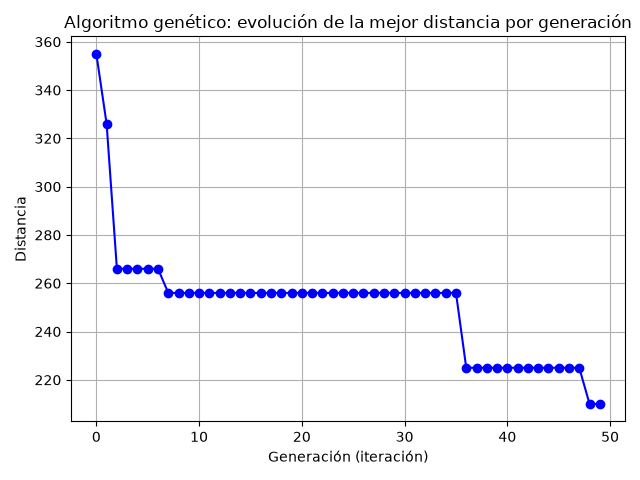 | 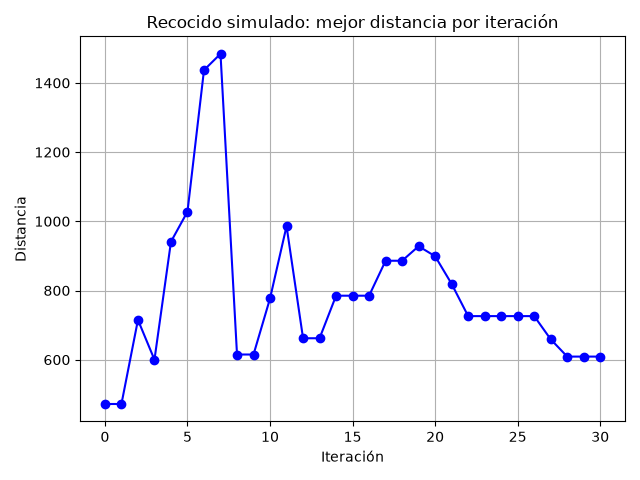 |
|---------------------|---------------------|


### Ejecución de los algoritmos con modificaciones

Realizando pruebas, aumentar demasiado los parámetros para el GA, 
no suele resultar en mejores rutas, utilizar un valor de mutación
preciso, que cambie lo suficiente, pero no demasiado, suele ayudar.

Para el recocido simulado, aumentar más los parámetros y dejar que
realice muchas iteraciones, bajando la tasa de enfriamiento, 
resulta en mejores rutas aunque a un tiempo peor.

En esta siguiente prueba, se cambiaron los argumentos para ambos
algoritmos y, de forma empirica, se encontró que el SA suele 
generar soluciones en el rango de GA + 60 puntos en distancia 
total, con un costo de más iteraciones y con un aumento de 
alrededor de 200 a 300 ms en tiempo.

```shell
python3 main.py s3 -g -gs 300 -p 100 -b 20 -m 0.6 -c 0.9999
```

<pre>
Reporte de Algoritmo genético
  Nodos totales:    10
  Ruta:             G → H → A → C → B → E → F → D → I → J
  Distancia total:  189
  Total de arcos:   10
    Tiempo de
    ejecución:      47.0158 ms
    Tamaño de
    población:       100
  Generaciones:      300
   Cantidad de
     mejores
   seleccionados:   20
  Tasa de mutación:  0.6
</pre>

<pre>
Reporte de Recocido simulado
  Nodos totales:    10
  Ruta:             J → I → D → F → E → B → C → A → H → G
  Distancia total:  189
  Total de arcos:   10
    Tiempo de
    ejecución:      107.0428 ms
    Temperatura
      inicial:      10000
    Temperatura
      minima:       10
      Tasa de
    enfriamiento:   0.9999
</pre>

| 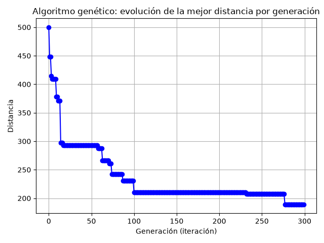 | 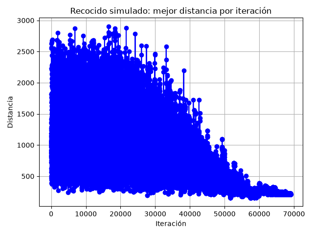 |
|---------------------|---------------------|


### Preguntas de análisis y conclusiones

- **¿Cómo afecta la temperatura inicial T₀ de SA a la diversidad de soluciones exploradas?**

Utilizar una temperatura inicial más alta hace que el algoritmo
realice más iteraciones y la calidad sea más alta, incrementar la 
temperatura tiene un efecto similar a ralentizar el enfriamiento.

Aunque, por otra parte, la _alta temperatura_ invita a que se tomen
soluciones subóptimas de forma más frecuente, lo que retrasa la 
convergencia.

- **¿Cómo se compara el Algoritmo Genético respecto a SA en términos de calidad/tiempo?**

Depende bastante de los parámetros utilizados para cada algoritmo.

Utilizando los parámetros establecidos por defecto, sin algún 
criterio específico:

En términos de calidad, el GA suele tener bastante mejora en 
poco tiempo, pero parece más propenso a quedarse en los óptimos 
locales, donde cada iteración no resulta en más mejoras. 

Por otra parte, el SA tiene una convergencia lenta y al inicio
la mejora porcentual puede incluso volverse negativa, pero a 
medida que pasa el tiempo, la calidad mejora bastante, pero no 
llega a la calidad del GA.

Cambiando un poco los parámetros e intentando mejorarlos, pero que
consuman un tiempo similar, hay ocasiones donde el SA tiene una 
mejor ruta, otras veces no. El GA suele tener resultados más 
consistentes, con variaciones de no más de 50 unidades, medidos de
forma empirica, donde, por otra parte, el SA suele tener 
variaciones bastante más importantes.

```shell
# Parámetros para las siguientes pruebas
python3 main.py s3 -i 600 -c 0.999 -p 90 -gs 30 -b 10 -m 0.3 -g
```

Ambos algoritmos consumen alrededor de 6.2 ms, en esta prueba
SA obtuvo un mejor resultado.

<pre>
Reporte de Algoritmo genético
  Nodos totales:    10
  Ruta:             J → D → I → A → H → G → B → C → F → E
  Distancia total:  211
  Total de arcos:   10
    Tiempo de
    ejecución:      6.2664 ms
    Tamaño de
    población:       90
  Generaciones:      30
   Cantidad de
     mejores
   seleccionados:   10
  Tasa de mutación:  0.3
</pre>

<pre>
Reporte de Recocido simulado
  Nodos totales:    10
  Ruta:             G → H → A → B → C → F → E → I → D → J
  Distancia total:  154
  Total de arcos:   10
    Tiempo de
    ejecución:      6.2254 ms
    Temperatura
      inicial:      600.0
    Temperatura
      minima:       10
      Tasa de
    enfriamiento:   0.999
</pre>

| 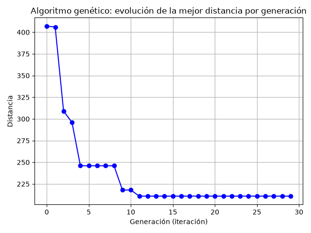  | 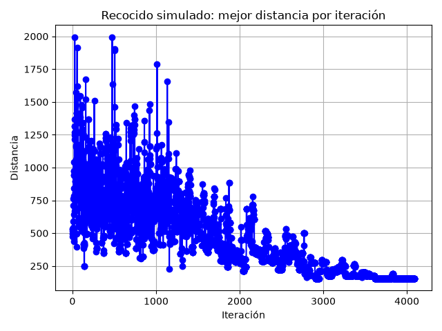  |
|----------------------|----------------------|
| 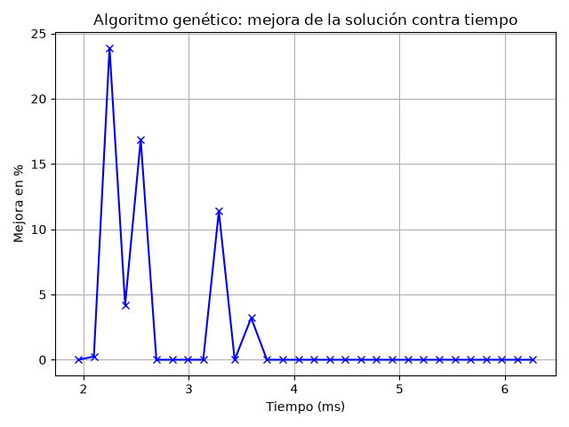 | 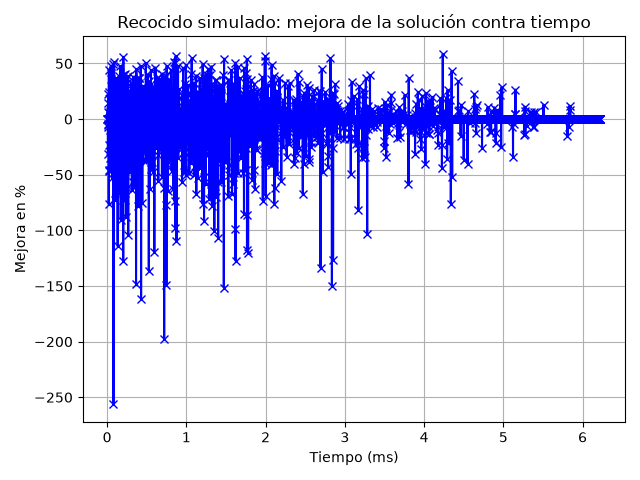 |


En esta otra prueba ambos llegaron a la misma respuesta (el 
mejor óptimo visto hasta el momento),

<pre>
Reporte de Algoritmo genético
  Nodos totales:    10
  Ruta:             G → H → A → B → C → F → E → I → D → J
  Distancia total:  154
  Total de arcos:   10
    Tiempo de
    ejecución:      6.2475 ms
    Tamaño de
    población:       90
  Generaciones:      30
   Cantidad de
     mejores
   seleccionados:   10
  Tasa de mutación:  0.3
</pre>

<pre>
Reporte de Recocido simulado
  Nodos totales:    10
  Ruta:             J → D → I → E → F → C → B → A → H → G
  Distancia total:  154
  Total de arcos:   10
    Tiempo de
    ejecución:      6.1909 ms
    Temperatura
      inicial:      600.0
    Temperatura
      minima:       10
      Tasa de
    enfriamiento:   0.999
</pre>

En esta prueba GA tuvo un mejor resultado,

<pre>
Reporte de Algoritmo genético
  Nodos totales:    10
  Ruta:             J → D → I → E → F → B → C → A → H → G
  Distancia total:  167
  Total de arcos:   10
    Tiempo de
    ejecución:      6.2593 ms
    Tamaño de
    población:       90
  Generaciones:      30
   Cantidad de
     mejores
   seleccionados:   10
  Tasa de mutación:  0.3
</pre>

<pre>
Reporte de Recocido simulado
  Nodos totales:    10
  Ruta:             I → A → H → G → C → B → E → F → D → J
  Distancia total:  250
  Total de arcos:   10
    Tiempo de
    ejecución:      6.2207 ms
    Temperatura
      inicial:      600.0
    Temperatura
      minima:       10
      Tasa de
    enfriamiento:   0.999
</pre>


## Referencias

Uso de heapq y queue
- https://docs.python.org/3/library/heapq.html#basic-examples
- https://docs.python.org/3.14/library/queue.html

Uso de osmnx
- https://osmnx.readthedocs.io/en/stable/user-reference.html

Documentación networkx
- https://networkx.org/documentation/stable/tutorial.html#attributes

Documentación Pytest
- https://docs.pytest.org/en/stable/

Uso de argparse
- https://docs.python.org/3.14/library/argparse.html

Algoritmos DFS, BFS y UCS
- Programa web proporcionado: `busqueda_no_informada.html`

Algoritmo de búsqueda heurística A*
- https://www.ecured.cu/Algoritmo_de_Búsqueda_Heurística_A*

Algoritmo A*
- https://www.datacamp.com/es/tutorial/a-star-algorithm

Algoritmo genético
- https://antonio-richaud.com/biblioteca/archivo/Algoritmos-geneticos/algoritmos-geneticos.pdf

Algoritmo de recocido simulado
- https://optimization.cbe.cornell.edu/index.php?title=Simulated_annealing

Otra documentación consultada
- https://tedboy.github.io/networkx/reference/graph_types.multidigraph.html
- https://www.openstreetmap.org/node/11359618606#map=19/19.504152/-99.147103
- https://networkx.org/documentation/stable/auto_examples/drawing/plot_weighted_graph.html
- https://matplotlib.org/stable/gallery/shapes_and_collections/fancybox_demo.html
- https://stackoverflow.com/questions/1557571/how-do-i-get-time-of-a-python-programs-execution
- https://github.com/gboeing/osmnx-examples
- https://www.geeksforgeeks.org/python/stack-in-python/
- https://stackoverflow.com/questions/34764535/why-cant-matplotlib-plot-in-a-different-thread
- https://docs.python.org/3.14/library/multiprocessing.html#multiprocessing.Process
